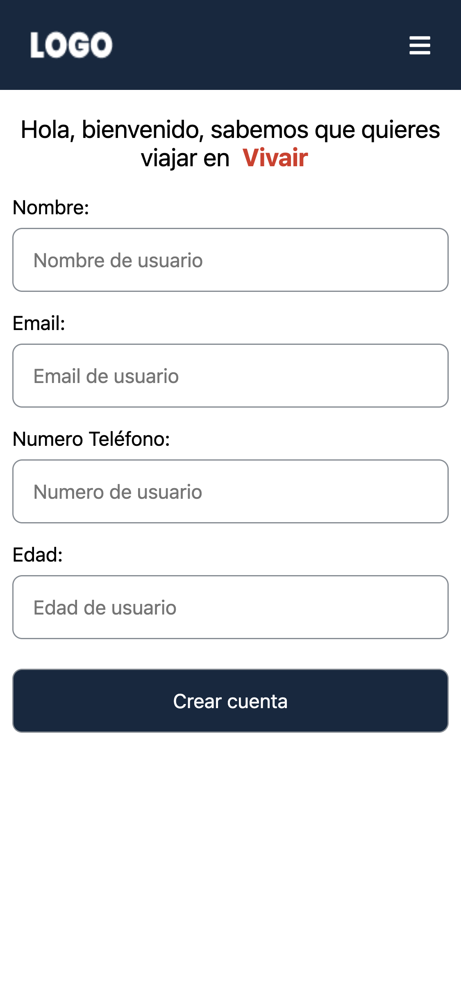

# Challenge Frontend 🚀

Description: App to register user for travel.

## Available Scripts

In the project directory, you can run this commands:

## Fist step, install the packages with `npm install` 🛠

Run the project in local, you need to run the server to get data:

### `npm run dev` ✅

Run production environment

## 1.- `npm run build` ⚙️

## 2.- `npm run start` 🚀

# Technologies 🛠

HTML5, CSS3, Sass ,JavaScript, React, Next, Context API.

Desktop

Movil

[See the app](https://challenge-react.vercel.app/) 📦
